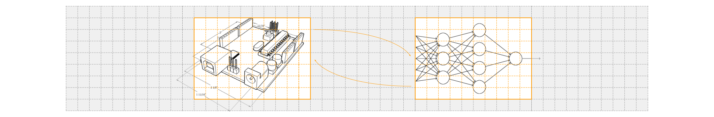
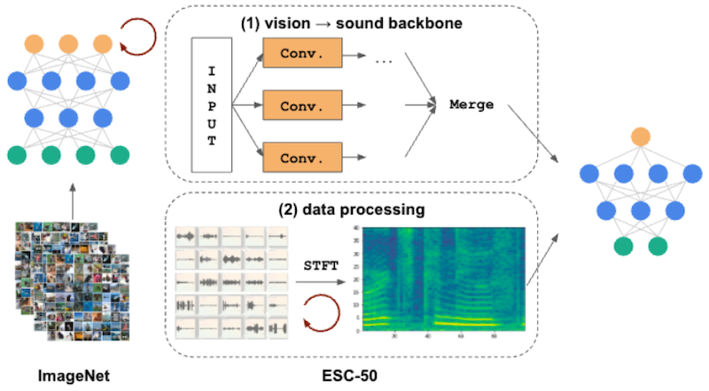
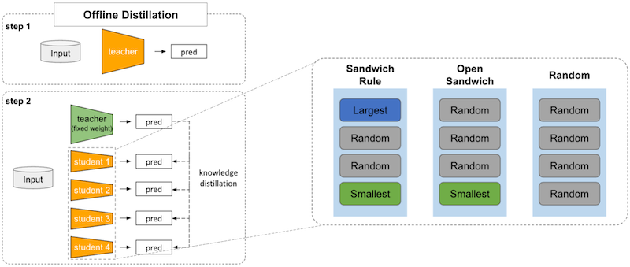

# Hello! <!-- {docsify-ignore-all} -->

#### 🧑🏻‍💻 I'm Sungjae Jeon, — AI Researcher

 

I am an **Efficient AI** researcher, focusing on making <U>efficient algorithms and systems for resource-constrained hardware</U>.

### Research Interests

  <a class="toc-page-display-a" id="no-img">
    

    

        

            <i class="fa-solid fa-microchip"></i> Model Compression and TinyML
        

        

            Neural Architecture Search ⋅ Pruning 
            Quantization ⋅ Knowledge Distillation
        

    

  </a>

  <a class="toc-page-display-a" id="no-img">
    

    

        

            <i class="fa-solid fa-diagram-project"></i> Sparse Neural Network
        

        

            Activation Sparsification 
            Inference Engine using Sparsity
        

    

  </a>

  

  <a class="toc-page-display-a" id="paper" href="https://kdas.or.kr/board/confevent/article/251998" target="_blank">
    

      

          
      

    

    

        

            Transfer Learning-based Neural Architecture Search for On-sensor Audio Classification
        

        

            2024.12.06 &nbsp; Proceedings of the Korean Data Analysis Society
        

    

  </a>

  <a class="toc-page-display-a" id="paper" href="https://www.dbpia.co.kr/journal/articleDetail?nodeId=NODE11705323" target="_blank">
    

      

          
      

    

    

        

            Neural Architecture Search for Efficient On-Sensor Inference &nbsp;
        

        

            2023.12.20 &nbsp; Korea Software Congress(KSC) 2023
        

    

  </a>

  ### Recent Projects

  - **On-sensor AI**: [**STM32 Cloud Latency Lookup Table**](https://github.com/erectbranch/stm32ai-latency-lookup-table) is an **AI benchmark pipeline** on ST Edge AI Cloud MCU. [**ImageNet Validation with Microcontroller**](https://github.com/erectbranch/mcu-imagenet-benchmark) is a ImageNet validation on microcontroller with X-CUBE-AI inference engine.

  - **Parallel and Distributed Deep Learning**: [**Enroot on Slurm for Distributed Deep Learning**](https://github.com/erectbranch/enroot-on-slurm) is a comprehensive guide to using **Enroot on Slurm cluster** for deep learning tasks.

  

      [[slider]](https://raw.githubusercontent.com/erectbranch/stm32ai-latency-lookup-table/master/main.png|https://raw.githubusercontent.com/erectbranch/mcu-imagenet-benchmark/main/assets/figures/main.png|https://raw.githubusercontent.com/erectbranch/enroot-on-slurm/master/images/main.png)
  

  ### Study Notes

<a class="toc-page-display-a" id="no-img" href="#/notes/mit-6s965/README" target="_blank">
  

  

      

          TinyML and Efficient Deep Learning Computing
      

      

          MIT 6.S965 • 2022 • efficientml.ai
      

  

</a>

<a class="toc-page-display-a" id="no-img" href="#/notes/udemy-speaker/README" target="_blank">
  

  

      

          Speaker Recognition
      

      

          Udemy • 2022 • udemy.com/course/speaker-recognition
      

  

</a>

<a class="toc-page-display-a" id="no-img" href="#/notes/cs11-711/README" target="_blank">
  

  

      

          Advanced NLP
      

      

          CMU CS 11-711 • 2022 • phontron.com/class/anlp2022
      

  

</a>

<a class="toc-page-display-a" id="no-img" href="#/notes/arm-system-guide/README" target="_blank">
  

  

      

          ARM System Developer's Guide
      

      

          Morgan Kaufmann • 2004
      

  

</a>

<a class="toc-page-display-a" id="no-img" href="#/notes/cod/README" target="_blank">
  

  

      

          Computer Organization and Design RISC-V Edition
      

      

          Elsevier • 2017
      

  

</a>

<a class="toc-page-display-a" id="no-img" href="#/notes/ucos2/README" target="_blank">
  

  

      

          MicroC/OS-II The Real-Time Kernel
      

      

          CRC Press • 2002
      

  

</a>

<a class="toc-page-display-a" id="no-img" href="#/notes/modern-c/README" target="_blank">
  

  

      

          Modern C
      

      

          길벗 • 2022
      

  

</a>

<a class="toc-page-display-a" id="no-img" href="#/notes/python-trick/README" target="_blank">
  

  

      

          Python Tricks
      

      

          인사이트 • 2019
      

  

</a>

<a class="toc-page-display-a" id="no-img" href="#/notes/pro-cuda-c/README" target="_blank">
  

  

      

          Professional CUDA C Programming
      

      

          Wrox • 2014
      

  

</a>

<a class="toc-page-display-a" id="no-img" href="#/notes/enroot-slurm/README" target="_blank">
  

  

      

          Enroot on Slurm for Distributed Deep Learning
      

      

          Sungjae Jeon • 2025
      

  

</a>

  ### Contact
  ✉️ erectbranch@gmail.com

