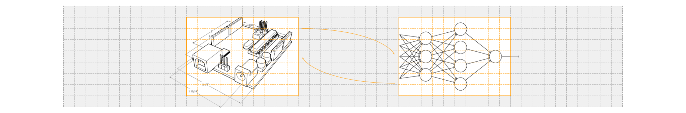

# Hello! <!-- {docsify-ignore-all} -->

#### 🧑🏻‍💻 I'm Sungjae Jeon, — AI Researcher

 

I am an **Efficient AI** researcher, focusing on making <U>efficient algorithms and systems for resource-constrained hardware</U>.

  ### Study Notes

<a class="toc-page-display-a" id="no-img" href="#/notes/mit-6s965/README" target="_blank">
  

  

      

          TinyML and Efficient Deep Learning Computing
      

      

          MIT 6.S965 • 2022 • efficientml.ai
      

  

</a>

<a class="toc-page-display-a" id="no-img" href="#/notes/udemy-speaker/README" target="_blank">
  

  

      

          Speaker Recognition
      

      

          Udemy • 2022 • udemy.com/course/speaker-recognition
      

  

</a>

<a class="toc-page-display-a" id="no-img" href="#/notes/cs11-711/README" target="_blank">
  

  

      

          Advanced NLP
      

      

          CMU CS 11-711 • 2022 • phontron.com/class/anlp2022
      

  

</a>

<a class="toc-page-display-a" id="no-img" href="#/notes/arm-system-guide/README" target="_blank">
  

  

      

          ARM System Developer's Guide
      

      

          Morgan Kaufmann • 2004
      

  

</a>

<a class="toc-page-display-a" id="no-img" href="#/notes/cod/README" target="_blank">
  

  

      

          Computer Organization and Design RISC-V Edition
      

      

          Elsevier • 2017
      

  

</a>

<a class="toc-page-display-a" id="no-img" href="#/notes/ucos2/README" target="_blank">
  

  

      

          MicroC/OS-II The Real-Time Kernel
      

      

          CRC Press • 2002
      

  

</a>

<a class="toc-page-display-a" id="no-img" href="#/notes/modern-c/README" target="_blank">
  

  

      

          Modern C
      

      

          길벗 • 2022
      

  

</a>

<a class="toc-page-display-a" id="no-img" href="#/notes/python-trick/README" target="_blank">
  

  

      

          Python Tricks
      

      

          인사이트 • 2019
      

  

</a>

<a class="toc-page-display-a" id="no-img" href="#/notes/pro-cuda-c/README" target="_blank">
  

  

      

          Professional CUDA C Programming
      

      

          Wrox • 2014
      

  

</a>

<a class="toc-page-display-a" id="no-img" href="#/notes/enroot-slurm/README" target="_blank">
  

  

      

          Enroot on Slurm for Distributed Deep Learning
      

      

          Sungjae Jeon • 2025
      

  

</a>

  ### Contact
  ✉️ erectbranch@gmail.com

